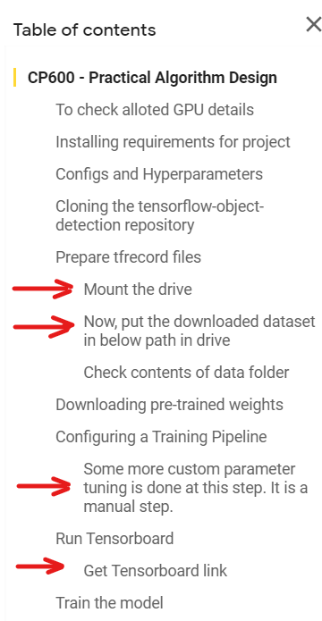

# Steps to run the code implementation

## Notes:
1. `Model_training_faster_rcnn.ipynb` - is for loading and training the model
2. `Model_testing.ipynb` - is for testing the model and checking detection results

## Model_training_faster_rcnn.ipynb Colab Notebook

1. Open the `Model_training_faster_rcnn.ipynb` in google colab

2. Path to download data: 
[Hard hat workers Dataset - TF Records Format](https://public.roboflow.com/object-detection/hard-hat-workers/2/download/tfrecord)

3. Make a directory in your Google Drive named `data` (Same Google account from which colab notebook is opened)

4. Archive the downloaded dataset containing TFRecord files into ZIP and upload it to above `data` directory in drive

5. Below is the image in which manual steps are highlighted with red arrows. Rest all steps can be run Ctrl+Enter step by step sequencially from top to bottom.

## Model_testing.ipynb Colab Notebook

1. In google drive, make a directory named `object_detection`

2. Make 2 sub directories inside `object_detection`.

3. Make `object_detection/test` to test detection on images. Need to upload test images to this directory

4. Make `object_detection/fine_tuned_model` that contains `frozen_inference_graph.pb`, `Workers_label_map.pbtxt` and `faster_rcnn_inception_v2_pets.config` which is required to run inference/detection test.

5. Please note, whole directory with above required files is already available in submission folder with name as `object_detection` Please upload this to google drive directly.